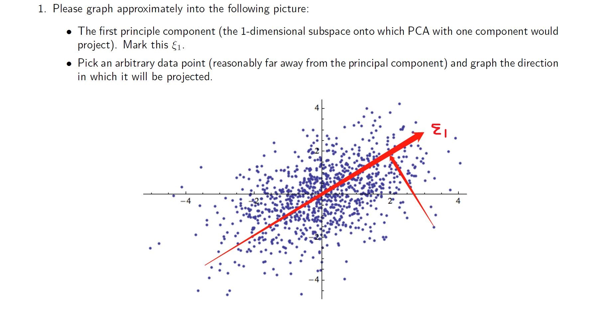

## Problem 1 PCA


### 2
#### a)
There are 10304 principle components in total

#### b)
$$\hat{X} = UDV^T$$
$U$ is a 100x10304 left sigular vector.

$D$ is a 10304x10304 diagonal matrix contains eigenvalues for each principle component such that $d_1 \geq d_2 \geq ... \geq d_{10304}$

$V^T$ is a 10304x10304 right sigular orthogonal matrix, each row stands for each principle component spaces, and column stands for feature spaces.

Therefore, the first 48 principle componets to represent:

$$\hat{X_i} = \bar{x_i} + x_{i,1}v_{i,1} + x_{i,2}v_{i,2} +...+ x_{i,48}v_{i,48}$$

## Problem 2
### 1
```{r, message=F}
library(quantmod)
library(factoextra)
library(ggplot2)

company = c("MMM","AXP","AAPL","BA","CAT", "CVX", "CSCO","KO","DWDP","XOM","GS","HD","IBM","INTC","JNJ","JPM","MCD","MRK","MSFT","NKE","PFE","PG","TRV","UNH","UTX","VZ","V","WMT","WBA","DIS")

data = c()
for(i in company)
{
  data = cbind(data, getSymbols(i, auto.assign = F, from = "2018-01-01", to = "2019-01-01")[,4])
}
colnames(data) = gsub(".Close", "", colnames(data))
```

### 2
```{r}
pc.pipline = function(data, scale, summary)
{
  pc = princomp(data, cor= scale)
  a = fviz_pca_biplot(pc, geom = "point", repel = F, col.var = "#2E9FDF")
  b = fviz_eig(pc)
  if(summary == T)
    c = summary(pc)
  else
    c = NULL
  return(list(a, b, c))
}

pc.pipline(data, F, T)
```
There are some structures in the biplot

* left direction is most likely related to food, healthcare and pharamcy
* up direction is about chemical, energy and retail industry
* right direction is related to information technologies

Based on summary table, when choose 6 principle components, the cumulative Proportion is reaching 95%

### 3
```{r}
pc.pipline(data, T, T)
```

Based on summary table, when choose 8 principle components, the cumulative Proportion is reaching 95%

### 4
```{r}
data = as.matrix(data)
data.today = as.matrix(data[1:250,])
data.tmr = as.matrix(data[2:251,])
return = (data.tmr - data.today)/data.today

pc.pipline(return, T, T)
```

The biplot is telling that all the return is focusing on chemical, energy, retail and information technologies industry. Based on screeplot, first three principle components have already catch most information from data.

If each stock were fluctuating up and down randomly and independent of all the stocks, then expect each principle component has similar weight because each direction catchs different information from data.

## Problem 3

Let T be the centered inner product matrix with elements $<Z_i - \bar{Z_i}, Z_i - \bar{Z}>$, then $\sum_{i,i'}^n{(s_{i,i'} - <z_i - \bar{z}, z_{i'} - \bar{z}>)}$

Assume that the eign decomposition of $S$ and $T$ are $UD^2U^T$ and $\tilde{U}\tilde{D}^2\tilde{U}^T$

$$S_c(z_1, z_2, ..., z_n) = tr[(UD^2U^T - \tilde{U}\tilde{D}^2\tilde{U}^T)^2] = tr[D^4U^2U^{2T} + \tilde{D}^4\tilde{U}^2\tilde{U}^{2T} - 2D^2U^T\tilde{U}\tilde{D}^2\tilde{U}^TU]$$

$$=tr[D^4 + \tilde{D}^4 - 2D^2U^T\tilde{U}\tilde{D}^2\tilde{U}^TU]$$

Let $A = U^T\tilde{U}$, where $a_{ij}$ is the $(i,j)th$ element of $A$

$$\frac{\partial S_c}{\partial \tilde{d}^2} =  d^2 + \tilde{d}^2 - 2\sum_i^n d_i^2 a_{ij}^2$$

$$= 2\tilde{d}^2 - 2\sum_i^n d_i^2 a_{ij}^2$$

Minimizing $S_c(z_1, z_2, ..., z_n) \rightarrow \frac{\partial S_c}{\partial \tilde{d}^2} = 0$

$\rightarrow \tilde{d}^2 = \sum_i^n d_i^2 a_{ij}^2$

$\rightarrow max \sum_i^n d_i^2 a_{ij}^2 = \sum_i^n (\tilde{u}_i^TUD^2U^T\tilde{u}_i)^2$

$\rightarrow S_c(z_1, z_2, ..., z_n) = X^T\tilde{U}$, where $\tilde{U}$ is $k \times k$ orthogonal matrix, and $ith$ column stands for each principle component. Therefore, $X^T\tilde{U}$ is mapping to the first k principle components with the largest variance $d^2$


