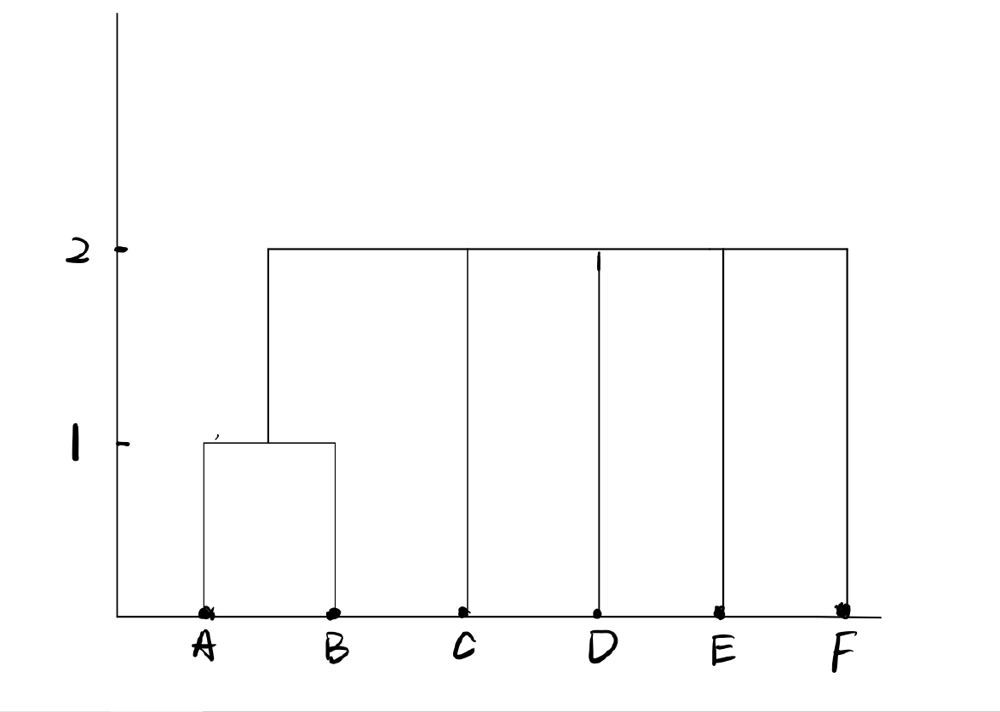

```{r, echo=F}
library(purrr)
library(ggplot2)
library(tibble)

#setwd("C:/Users/jay48/OneDrive/Documents/work/Statistical ML/HW6")
setwd("C:/Users/jie/skyDrive/Documents/work/Statistical ML/HW6")
```

## Problem I
$$d(A,B) = 1$$

$$d(A,C) = 2$$

$$d(D,E) = 2$$

$$d(E,F) = 2$$

Note: the distance of other combinations is larger than 2 



## Problem II
#### 1
The 3-gram model is the model conditional on the two previous words and the model is

$$P(w_i|w_{i-1}, w_{i-2})$$

$$P(w_1, w_2, w_3, ..., w_n) = P(w_1)P(w_2)\prod_{i=3}^nP(w_i|w_{i-1}, w_{i-2})$$

The distribution in the 3_gram model, where P is the multinomial distribution.

$$P(w_i = j|w_{i-1} = k, w_{i-2} = m) = P(H_j = 1|\hat{t_k}, \hat{t_m})$$

#### 2

* train naive bayesian classifier model to filter spam emails $P(spam | words_{i...n}) = P(words_{i...n}|spam) * P(spam) / P(words_{i...n})$

* observe $P(w_i|span), P(w_i|w_{i-1}, spam), P(w_i|w_{i-1}, w_{i-2}, spam)$

* compute $P(words_{i...n}|spam) = P(w_i|w_{i-1}, w_{i-2}, spam)\prod_{i=3}^nP(w_i|w_{i-1}, w_{i-2})$

#### 3
Finally, based on the probability of each word given by spam to classify the whether spam or not.

## Problem III
#### 1
```{r}
MultinomialEM = function(H,K,tau)
{
  delta = 10
  n = dim(H)[1]
  c = rep(1/K, K)
  a0 = matrix(0, n, K)
  
  index = sample(1:dim(H)[1], K)

  h = H[index, ]
  h = ifelse(h == 0, 0.5, h)
  t = h/rowSums(h)
  
  
  while (delta >= tau)
  {
    phi = exp(H %*% t(log(t)))
    
    a = t(c * t(phi)) / rowSums(t(c* t(phi)))
      
    c = colSums(a)/n
    
    b = t(a) %*% H
    
    t = b / rowSums(b)
    
    delta = norm((a-a0), "O")

    a0 = a
  }
  return(apply(a, 1, which.max))
}

```


#### 2
```{r}
H = matrix(readBin("histograms.bin", "double", 640000), 40000, 16) %>% as.matrix()

# 115
set.seed(345)
m1 = MultinomialEM(H, 3, 0.1)
head(m1)
m2 = MultinomialEM(H, 4, 0.15)
head(m2)
m3 = MultinomialEM(H, 5, 0.3)
head(m3)
```

#### 3
```{r}
image = matrix(m3,nrow = 200,ncol = 200)
image = image[,ncol(image):1]
image(image,col = gray((2:8)/8), axes = F)
```


