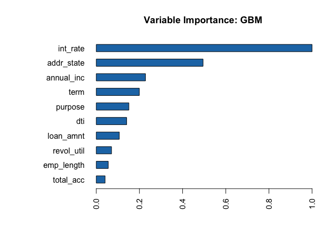
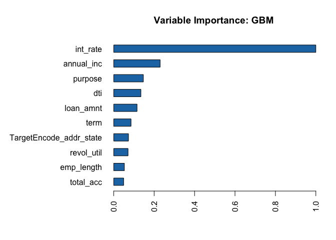

Target Encoding
---------------

Target encoding is the process of replacing a categorical value with the mean of the target variable. In this example, we will be trying to predict `bad_loan` using our cleaned lending club data: <https://raw.githubusercontent.com/h2oai/app-consumer-loan/master/data/loan.csv>. One of the predictors is `addr_state`, a categorical column with 50 unique values. To perform target encoding on `addr_state`, we will calculate the average of `bad_loan` per state (since `bad_loan` is binomial, this will translate to the proportion of records with `bad_loan = 1`).

For example, target encoding for `addr_state` could be:

| addr\_state | average bad\_loan |
|-------------|-------------------|
| AK          | 0.1476998         |
| AL          | 0.2091603         |
| AR          | 0.1920290         |
| AZ          | 0.1740675         |
| CA          | 0.1780015         |
| CO          | 0.1433022         |

Instead of using state as a predictor in our model, we could use the target encoding of state.

In this document, we will walk through the steps for using target encoding to convert categorical columns to numeric. This can help improve machine learning accuracy since algorithms tend to have a hard time dealing with high cardinality columns.

In the jupyter notebook: [categorical predictors with tree based model](gbm_drf.ipynb), we discussed two methods for dealing with high cardinality columns:

-   comparing model performance after removing high cardinality columns
-   parameter tuning (specifically tuning `nbins_cats` and `categorical_encoding`)

In this document, we will try using target encoding to improve our model performance.

Train Baseline Model
--------------------

We will start by training a model using the original data. Below we import our data into the H2O cluster:

``` r
library('h2o')
h2o.init()
h2o.no_progress()

df <- h2o.importFile("https://raw.githubusercontent.com/h2oai/app-consumer-loan/master/data/loan.csv")
df$bad_loan <- as.factor(df$bad_loan)
```

We will randomly split the data into 75% training and 25% testing. We will use the testing data to evaluate how well the model performs.

``` r
# Split Frame into training and testing
splits <- h2o.splitFrame(df, seed = 1234, destination_frames=c("train.hex", "test.hex"), ratios = 0.75)
train <- splits[[1]]
test <- splits[[2]]
```

Now we can train our baseline model. We will train a GBM model with early stopping.

``` r
response <- "bad_loan"
predictors <- c("loan_amnt", "int_rate", "emp_length", "annual_inc", "dti", "delinq_2yrs", "revol_util", "total_acc", 
                "longest_credit_length", "verification_status", "term", "purpose", "home_ownership", "addr_state")

gbm_baseline <- h2o.gbm(x = predictors, y = response, 
                        training_frame = train, validation_frame = test,
                        score_tree_interval = 10, ntrees = 500,
                        sample_rate = 0.8, col_sample_rate = 0.8, seed = 1234,
                        stopping_rounds = 5, stopping_metric = "AUC", stopping_tolerance = 0.001,
                        model_id = "gbm_baseline.hex")
```

The AUC on the training and testing data is shown below:

``` r
# Get AUC
train_auc <- h2o.auc(gbm_baseline, train = TRUE)
valid_auc <- h2o.auc(gbm_baseline, valid = TRUE)

auc_comparison <- data.frame('Data' = c("Training", "Validation"),
                             'AUC' = c(train_auc, valid_auc))
```

| Data       |     AUC|
|:-----------|-------:|
| Training   |  0.7493|
| Validation |  0.7070|

Our training data has much higher AUC than our validation data.

The variables with the greatest importance are the `int_rate` and the `addr_state`. It makes sense that the `int_rate` has such high variable importance since this is related to loan default but it is surprising that `addr_state` has such high variable importance. The high variable importance could be because our model is memorizing the training data through this high cardinality categorical column.

``` r
# Variable Importance
h2o.varimp_plot(gbm_baseline)
```



We will see if our AUC improves on the test data if we remove the `addr_state` predictor. This can indicate that our model is memorizing the training data.

``` r
predictors <- setdiff(predictors, "addr_state")

gbm_no_state <- h2o.gbm(x = predictors, y = response, 
                        training_frame = train, validation_frame = test, 
                        score_tree_interval = 10, ntrees = 500,
                        sample_rate = 0.8, col_sample_rate = 0.8, seed = 1234,
                        stopping_rounds = 5, stopping_metric = "AUC", stopping_tolerance = 0.001,
                        model_id = "gbm_no_state.hex")
```

The AUC for our baseline model and our model without `addr_state` are shown below:

``` r
# Get AUC
auc_baseline <- h2o.auc(gbm_baseline, valid = TRUE)
auc_nostate <- h2o.auc(gbm_no_state, valid = TRUE)

auc_comparison <- data.frame('Model' = c("Baseline", "No addr_state"),
                             'AUC' = c(auc_baseline, auc_nostate))
```

We see a slight improvement in our test AUC if we do not include the `addr_state` predictor. This is a good indication that the GBM model may be overfitting with this column.

| Model          |     AUC|
|:---------------|-------:|
| Baseline       |  0.7070|
| No addr\_state |  0.7076|

Target Encoding in H2O-3
------------------------

Now we will perform target encoding on `addr_state` to see if this representation improves our model performance.

Target encoding in H2O-3 is performed in two steps:

1.  create a target encoding map: this will contain the sum of the response column and the count
2.  apply a target encoding map: the target encoding map is applied to the data by adding new columns with the target encoding values.

To apply the target encoding, we have several options included to prevent overfitting:

-   `holdout_type`: whether or not a holdout should be used in constructing the target average
-   `blended_avg`: whether to perform a blended average
-   `noise_level`: whether to include random noise to the average

### Holdout Type

The `holdout_type` parameter defines whether the target average should be constructed on all rows of data. Overfitting can be prevented by removing some hold out data when calculating the target average on the training data.

The `h2o.target_encode_apply` function offers the options:

*   None: no holdout, mean is calculating on all rows of data \*\* this should be used for test data
*   LeaveOneOut: mean is calculating on all rows of data excluding the row itself 
	*   this can be used for the training data - the target of the row itself is not included in the average to prevent overfitting
*   KFold: mean is calculating on out-of-fold data only (requires a fold column)
	*   this can be used for the training data - the target average is calculated on the out of fold data to prevent overfitting

### Blended Average

The `blended_avg` parameter defines if the target average should be weighted based on the count of the group. It is often the case, that some groups may have a small number of records and the target average will be unreliable. To prevent this, the blended average takes a weighted average of the group's target value and the global target value.

### Noise Level

The `noise_level` parameter determines if random noise should be added to the target average.

Perform Target Encoding
-----------------------

We will start by creating the target encoding map. This has the number of bad loans per state (`numerator`) and the number of rows per state (`denominator`). We can later use this information to create the target encoding per state.

``` r
train$fold <- h2o.kfold_column(train, 5, seed = 1234)
te_map <- h2o.target_encode_create(train, x = list("addr_state"), y = response, fold_column = "fold")
head(te_map$addr_state)
```

    ##   addr_state fold numerator denominator
    ## 1         AK    0         7          52
    ## 2         AK    1         8          55
    ## 3         AK    2         7          56
    ## 4         AK    3        13          68
    ## 5         AK    4         8          70
    ## 6         AL    0        57         297

Let's apply the target encoding to our training and testing data. For our training data, we will use the parameters:

-   `holdout_type`: "KFold"
-   `blended_avg`: TRUE
-   `noise_level`: NULL (by default it will add 0.01 \* range of y of random noise)

``` r
ext_train <- h2o.target_encode_apply(train, x = list("addr_state"), y = response, 
                                     target_encode_map = te_map, holdout_type = "KFold",
                                     fold_column = "fold",
                                     blended_avg = TRUE, noise_level = 0, seed = 1234)

head(ext_train[c("addr_state", "fold", "TargetEncode_addr_state")])
```

    ##   addr_state fold TargetEncode_addr_state
    ## 1         AK    0               0.1445783
    ## 2         AK    0               0.1445783
    ## 3         AK    0               0.1445783
    ## 4         AK    0               0.1445783
    ## 5         AK    0               0.1445783
    ## 6         AK    0               0.1445783

For our testing data, we will use the parameters:

-   `holdout_type`: "None"
-   `blended_avg`: False
-   `noise_level`: 0

We do not need to apply any of the overfitting prevention techniques since our target encoding map was created on the training data, not the testing data.

``` r
ext_test <- h2o.target_encode_apply(test, x = list("addr_state"), y = response,
                                    target_encode_map = te_map, holdout_type = "None",
                                    fold_column = "fold",
                                    blended_avg = FALSE, noise_level = 0)

head(ext_test[c("addr_state", "TargetEncode_addr_state")])
```

    ##   addr_state TargetEncode_addr_state
    ## 1         AK               0.1428571
    ## 2         AK               0.1428571
    ## 3         AK               0.1428571
    ## 4         AK               0.1428571
    ## 5         AK               0.1428571
    ## 6         AK               0.1428571

Train Model with KFold Target Encoding
--------------------------------------

We will train a new model, this time replacing the `addr_state` with the `TargetEncode_addr_state`.

``` r
predictors <- c("loan_amnt", "int_rate", "emp_length", "annual_inc", "dti", "delinq_2yrs", "revol_util", "total_acc", 
                "longest_credit_length", "verification_status", "term", "purpose", "home_ownership", "TargetEncode_addr_state")

gbm_state_te <- h2o.gbm(x = predictors, y = response, 
                        training_frame = ext_train, validation_frame = ext_test, 
                        score_tree_interval = 10, ntrees = 500,
                        stopping_rounds = 5, stopping_metric = "AUC", stopping_tolerance = 0.001,
                        model_id = "gbm_state_te.hex")
```

The AUC of the first and second model is shown below:

``` r
# Get AUC
auc_state_te <- h2o.auc(gbm_state_te, valid = TRUE)

auc_comparison <- data.frame('Model' = c("No Target Encoding", "No addr_state", "addr_state Target Encoding"),
                             'AUC' = c(auc_baseline, auc_nostate, auc_state_te))
```

| Model                       |     AUC|
|:----------------------------|-------:|
| No Target Encoding          |  0.7070|
| No addr\_state              |  0.7076|
| addr\_state Target Encoding |  0.7088|

We see a slight increase in the AUC on the test data. Now the `addr_state` has much smaller variable importance. It is no longer the 2nd most important feature but the 7th.

``` r
# Variable Importance
h2o.varimp_plot(gbm_state_te)
```



References
----------

-   [Target Encoding in H2O-3 Demo](https://github.com/h2oai/h2o-3/blob/master/h2o-r/demos/rdemo.target_encode.R)
-   Daniele Micci-Barreca. 2001. A preprocessing scheme for high-cardinality categorical attributes in classification and prediction problems. SIGKDD Explor. Newsl. 3, 1 (July 2001), 27-32.
-   [Automatic Feature Engineering Webinar](https://www.youtube.com/watch?v=VMTKcT1iHww)
